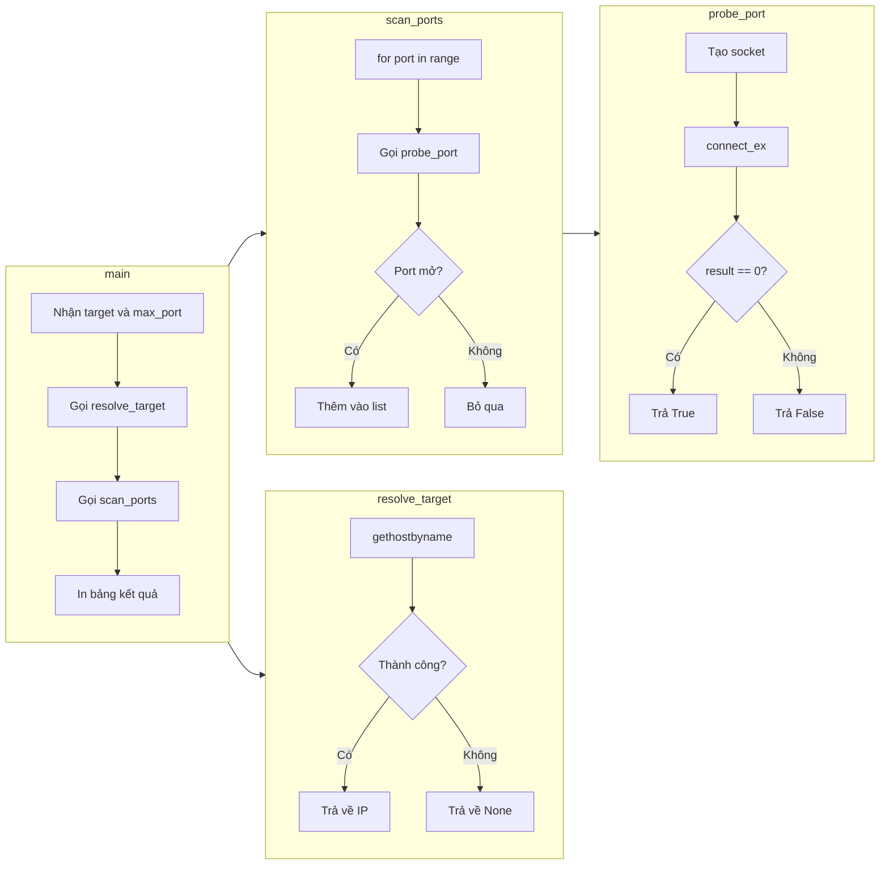

1- Phân tích ví dụ này

```python
import socket
import sys

def probe_port(ip, port, timeout=0.5):
    """Attempt a TCP connection to ip:port. Return True if open, False otherwise."""
    try:
        sock = socket.socket(socket.AF_INET, socket.SOCK_STREAM)
        sock.settimeout(timeout)
        result = sock.connect_ex((ip, port))
        sock.close()
        return result == 0
    except socket.error:
        return False

def scan_ports(ip, port_range, timeout=0.5):
    """Scan a range of ports on the target IP and return a list of open ports."""
    open_ports = []

    for port in port_range:
        if probe_port(ip, port, timeout):
            print(f"[+] Port {port} is open")
            open_ports.append(port)

    return open_ports

def resolve_target(target):
    
    """Resolve a hostname to an IP address. Return the IP if already valid."""
    #phân giải hostname sang ip 
    try:
        ip = socket.gethostbyname(target)
        if ip != target:
            print(f"[*] Resolved {target} to {ip}")
        return ip # trả về địa chỉ ip của hostname
    except socket.gaierror:
        print(f"[!] Could not resolve {target}")
        return None

def main():
	# check argument
    if len(sys.argv) < 2:
        print(f"Usage: python3 {sys.argv[0]} <target> [max_port]")
        print(f"Example: python3 {sys.argv[0]} 10.48.140.30 1024")
        sys.exit(1)

    target = sys.argv[1]
    max_port = int(sys.argv[2]) if len(sys.argv) > 2 else 1024
	# Phân giải target với resolve_target
    ip = resolve_target(target) # địa chỉ ip của hostname
    if not ip:
        sys.exit(1)
	
    print(f"[*] Scanning {ip} (ports 1-{max_port})...\n")
    open_ports = scan_ports(ip, range(1, max_port + 1))

    if open_ports:
        print(f"\n[*] Scan complete. {len(open_ports)} open port(s) found:")
        print(f"{'Port':<10}{'Likely Service':<20}")
        print("-" * 30)

        common_services = {
            21: "FTP", 22: "SSH", 23: "Telnet",
            25: "SMTP", 53: "DNS", 80: "HTTP",
            110: "POP3", 143: "IMAP", 443: "HTTPS",
            445: "SMB", 3306: "MySQL", 3389: "RDP",
            8080: "HTTP Proxy", 8443: "HTTPS Alt"
        }

        for port in sorted(open_ports):
            service = common_services.get(port, "Unknown")
            print(f"{port:<10}{service:<20}")
    else:
        print("\n[!] No open ports found.")

main()

```


3- Sơ đồ luồng logic theo các hàm:



4- Tóm gọn luồng chạy:
- `main` nhận input → `resolve_target` đổi hostname thành IP.
- `scan_ports` lặp qua từng port → gọi `probe_port` thử kết nối.
- `probe_port` dùng `connect_ex` (không raise exception) để check port mở/đóng.
- Port mở (result == 0) → lưu vào list.
- Cuối cùng `main` in bảng, dùng `common_services` dict để map port thành tên dịch vụ.