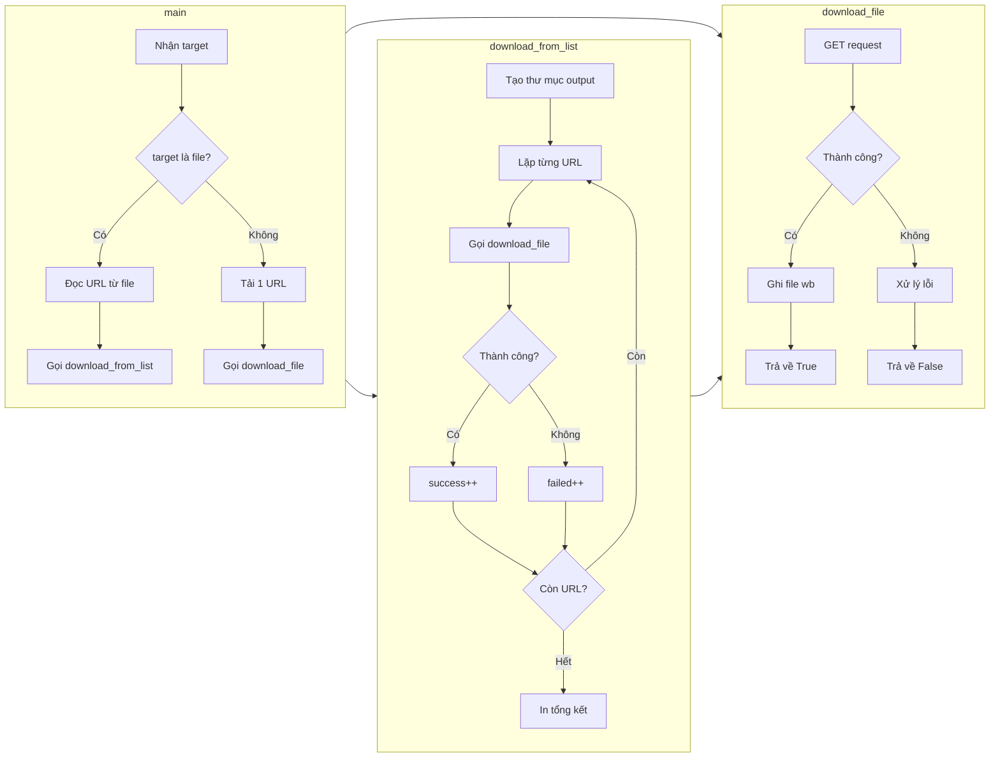

1. **Mục tiêu**

Viết script Python để tải file từ URL. Dùng thư viện `requests`. Xử lý được file lớn, nhiều URL, và lỗi mạng.


3. **Xử lý file lớn bằng streaming**

Vấn đề: `r.content` load cả file vào RAM. File 500MB sẽ treo máy.

Giải pháp: tải từng chunk nhỏ.

```python
def download_large_file(url, output_path, chunk_size=8192):
    """Download a file using streaming to handle large files efficiently."""
    try:
        r = requests.get(url, stream=True, allow_redirects=True, timeout=30)
        r.raise_for_status()

        total = 0
        with open(output_path, "wb") as f:
            for chunk in r.iter_content(chunk_size=chunk_size):
                f.write(chunk)
                total += len(chunk)

        print(f"[+] Downloaded: {output_path} ({total} bytes)")
        return True

    except (requests.ConnectionError, requests.Timeout, requests.HTTPError) as e:
        print(f"[!] Download failed: {e}")
        return False
```

Giải thích:
- `stream=True` – không tải hết ngay, mà giữ kết nối để đọc dần.
- `iter_content(chunk_size=8192)` – đọc từng 8KB, ghi xuống đĩa. RAM không tăng dù file to cỡ nào.
- Gộp nhiều exception vào một tuple để code gọn.


5. **Script hoàn chỉnh**

```python
import requests
import sys
import os

def download_file(url, output_path):
    try:
        r = requests.get(url, allow_redirects=True, timeout=10)
        r.raise_for_status()
        with open(output_path, "wb") as f:
            f.write(r.content)
        print(f"[+] Downloaded: {output_path} ({len(r.content)} bytes)")
        return True
    except requests.ConnectionError:
        print(f"[!] Connection failed: {url}")
        return False
    except requests.Timeout:
        print(f"[!] Request timed out: {url}")
        return False
    except requests.HTTPError as e:
        print(f"[!] HTTP error: {e}")
        return False

def download_from_list(url_list, output_dir="downloads"):
    os.makedirs(output_dir, exist_ok=True)
    results = {"success": 0, "failed": 0}
    for url in url_list:
        filename = url.split("/")[-1] or "index.html"
        output_path = os.path.join(output_dir, filename)
        if download_file(url, output_path):
            results["success"] += 1
        else:
            results["failed"] += 1
    print(f"\n[*] Complete: {results['success']} downloaded, {results['failed']} failed")
    return results

def main():
    if len(sys.argv) < 2:
        print(f"Usage: python3 {sys.argv[0]} <url_or_file>")
        sys.exit(1)

    target = sys.argv[1]

    if os.path.isfile(target):
        with open(target, "r") as f:
            urls = [line.strip() for line in f if line.strip()]
        print(f"[*] Loaded {len(urls)} URL(s) from {target}")
        download_from_list(urls)
    else:
        filename = target.split("/")[-1] or "downloaded_file"
        download_file(target, filename)

main()
```

Cách dùng:
- Tải 1 file: `python3 downloader.py http://example.com/file.zip`
- Tải từ danh sách: `python3 downloader.py urls.txt`

6. **Ví dụ chạy thực tế**
Tải một file:
```
ubuntu@tryhackme:~/Pentesting-Scripts$ python3 downloader.py http://MACHINE_IP:8000/files/config.txt
[+] Downloaded: config.txt (975 bytes)
```

Tải từ danh sách:
```
ubuntu@tryhackme:~/Pentesting-Scripts$ python3 downloader.py target_urls.txt
[*] Loaded 3 URL(s) from target_urls.txt
[+] Downloaded: downloads/config.txt (975 bytes)
[+] Downloaded: downloads/backup.zip (628 bytes)
[!] HTTP error: 404 Client Error: Not Found for url: http://127.0.0.1:8000/files/missing.dat

[*] Complete: 2 downloaded, 1 failed
```

7. Khi nào dùng

- Tìm được directory listing → tải hết JS về tìm API key.
- Thấy file backup trên web → tải về phân tích offline.
- Sau khi có shell → tải tool lên máy nạn nhân hoặc exfil data về.

8. Góc nhìn Defender

- Tải hàng loạt từ một IP tạo pattern dễ nhận ra trong log.
- DLP có thể flag file `.sql`, `.bak`, `.conf`, `.env`.
- Phòng thủ: tắt directory listing (Apache: `Options -Indexes`, Nginx: `autoindex off`).

9. Tóm gọn quy trình tư duy

```
Input: URL hoặc file chứa danh sách URL
Output: File đã tải về máy

Hàm chính:
- download_file()        -> tải 1 file, xử lý lỗi
- download_large_file()  -> tải file lớn bằng streaming
- download_from_list()   -> tải nhiều URL
- main()                 -> nhận input, gọi hàm phù hợp
```

Sơ đồ mermaid:

