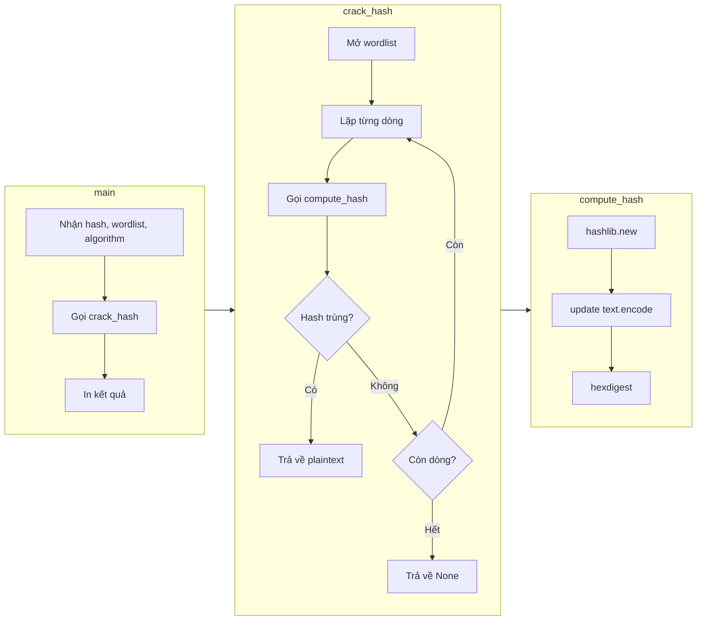

1. Hash là gì và tại sao không thể "đảo ngược"
Hash giống như máy xay sinh tố. Bỏ dâu và sữa vào → ra sinh tố. Không thể từ sinh tố mà tái tạo lại dâu và sữa. Hash cũng vậy: biến input thành một chuỗi cố định, không thể dịch ngược.

Muốn "crack" hash, ta không đảo ngược. Ta **thử từng khả năng**: lấy từng từ trong wordlist, hash nó, so với hash mục tiêu. Trùng thì tìm ra gốc. Cách này gọi là **dictionary attack**.

2. Ví dụ đơn giản
- Hash mục tiêu: `eccbc87e4b5ce2fe28308fd9f2a7baf3`
- Nghi ngờ mật khẩu là số từ 1-5.
- Hash lần lượt: 1, 2, 3, 4, 5.
- Hash của `3` = `eccbc87e4b5ce2fe28308fd9f2a7baf3` → trùng.
- Kết luận: plaintext là `3`.

2. Hàm hash một giá trị
```python
import hashlib

def compute_hash(text, algorithm="md5"):
    h = hashlib.new(algorithm)
    h.update(text.encode())
    return h.hexdigest()
```

Giải thích:
- `hashlib.new(algorithm)` – chọn thuật toán (md5, sha256...).
- `.encode()` – chuyển chuỗi thành bytes (hashlib yêu cầu bytes).
- `.hexdigest()` – trả về hash dạng chuỗi hex.

4. Hàm crack hash
```python
def crack_hash(target_hash, wordlist_path, algorithm="md5"):
    try:
        with open(wordlist_path, "r") as f:
            for line_number, line in enumerate(f, start=1):
                candidate = line.strip()
                if not candidate:
                    continue

                candidate_hash = compute_hash(candidate, algorithm)
                print(f"[*] {candidate} -> {candidate_hash}")

                if candidate_hash == target_hash.lower():
                    print(f"[+] Match found after {line_number} attempts!")
                    print(f"[+] Plaintext: {candidate}")
                    return candidate

        print(f"[-] Exhausted wordlist. No match found.")
        return None

    except FileNotFoundError:
        print(f"[!] Wordlist not found: {wordlist_path}")
        return None
```

Giải thích:
- Đọc từng dòng wordlist, không load hết vào RAM (tốt cho file lớn như rockyou.txt).
- `line.strip()` – bỏ khoảng trắng, newline.
- `target_hash.lower()` – chuẩn hóa hash mục tiêu về chữ thường.
- So sánh hash vừa tính với hash mục tiêu. Trùng → trả về plaintext.

5. Script hoàn chỉnh

```python
import hashlib
import sys

def compute_hash(text, algorithm="md5"):
    h = hashlib.new(algorithm)
    h.update(text.encode())
    return h.hexdigest()

def crack_hash(target_hash, wordlist_path, algorithm="md5"):
    try:
        with open(wordlist_path, "r") as f:
            for line_number, line in enumerate(f, start=1):
                candidate = line.strip()
                if not candidate:
                    continue

                candidate_hash = compute_hash(candidate, algorithm)
                print(f"[*] {candidate} -> {candidate_hash}")

                if candidate_hash == target_hash.lower():
                    print(f"[+] Match found after {line_number} attempts!")
                    print(f"[+] Plaintext: {candidate}")
                    return candidate

        print(f"[-] Exhausted wordlist. No match found.")
        return None

    except FileNotFoundError:
        print(f"[!] Wordlist not found: {wordlist_path}")
        return None

def main():
    if len(sys.argv) < 3:
        print(f"Usage: python3 {sys.argv[0]} <hash> <wordlist> [algorithm]")
        sys.exit(1)

    target_hash = sys.argv[1]
    wordlist_path = sys.argv[2]
    algorithm = sys.argv[3] if len(sys.argv) > 3 else "md5"

    print(f"[*] Cracking...\n")
    result = crack_hash(target_hash, wordlist_path, algorithm)

    if result:
        print(f"\n[*] Hash cracked successfully.")
    else:
        print(f"\n[*] Try a larger wordlist.")

main()
```

6. Ví dụ chạy với MD5

```
ubuntu@tryhackme:~/Pentesting-Scripts$ python3 hash_cracker.py eccbc87e4b5ce2fe28308fd9f2a7baf3 numbers.txt
[*] 0 -> cfcd208495d565ef66e7dff9f98764da
[*] 1 -> c4ca4238a0b923820dcc509a6f75849b
[*] 2 -> c81e728d9d4c2f636f067f89cc14862c
[*] 3 -> eccbc87e4b5ce2fe28308fd9f2a7baf3
[+] Match found after 4 attempts!
[+] Plaintext: 3
```

7. Ví dụ chạy với SHA-256

```
ubuntu@tryhackme:~/Pentesting-Scripts$ python3 hash_cracker.py f9194e73f9e9459e3450ea10a179cdf77aafa695beecd3b9344a98d111622243 numbers.txt sha256
[*] 0 -> 5feceb66ffc86f38d952786c6d696c79c2dbc239dd4e91b46729d73a27fb57e9
[*] 1 -> 6b86b273ff34fce19d6b804eff5a3f5747ada4eaa22f1d49c01e52ddb7875b4b
[*] 2 -> d4735e3a265e16eee03f59718b9b5d03019c07d8b6c51f90da3a666eec13ab35
[*] 3 -> 4e07408562bedb8b60ce05c1decfe3ad16b72230967de01f640b7e4729b49fce
[*] 4 -> 4b227777d4dd1fc61c6f884f48641d02b4d121d3fd328cb08b5531fcacdabf8a
[*] 5 -> ef2d127de37b942baad06145e54b0c619a1f22327b2ebbcfbec78f5564afe39d
[*] zero -> f9194e73f9e9459e3450ea10a179cdf77aafa695beecd3b9344a98d111622243
[+] Match found after 7 attempts!
[+] Plaintext: zero
```

8. Tại sao MD5 và SHA-1 yếu

- MD5 (128-bit) và SHA-1 (160-bit) tính toán cực nhanh. GPU có thể thử hàng tỷ hash/giây.
- Có lỗi va chạm (collision) – hai input khác nhau cho cùng hash.
- Không dùng cho lưu mật khẩu nữa.

Hệ thống hiện đại dùng bcrypt, scrypt, Argon2 – cố tình chậm, có salt (thêm chuỗi ngẫu nhiên). Nhưng pentest vẫn gặp MD5/SHA-1 trong hệ thống cũ.

9. Góc nhìn Defender

- Dùng thuật toán mạnh + salt.
- Yêu cầu mật khẩu dài, đa dạng ký tự.
- Kiểm tra mật khẩu với database rò rỉ.

10. Sơ đồ mermaid


