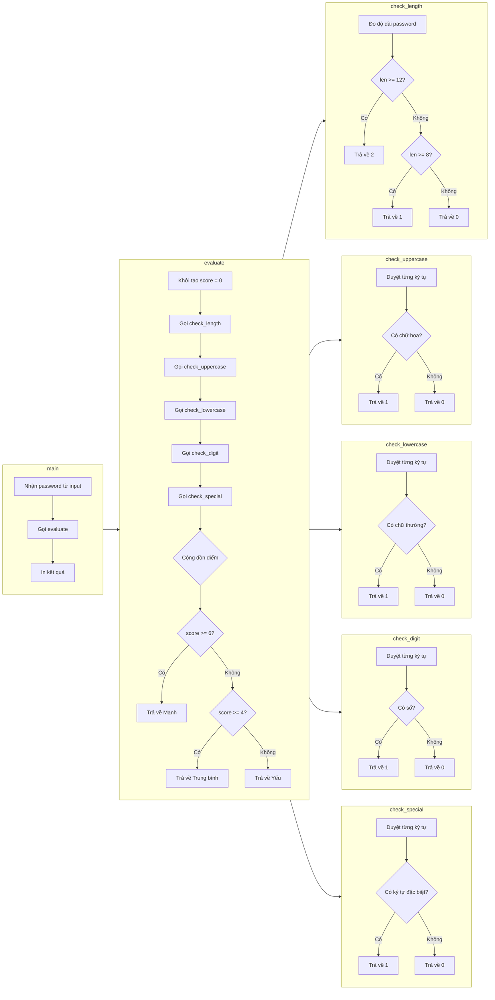

### 1. Phương pháp tổng quát: 5 câu hỏi trước khi viết code

Trước khi gõ bất kỳ dòng code nào, tao luôn tự hỏi 5 câu theo thứ tự:

- Câu 1: Bài toán này giải quyết cái gì?
- Câu 2: Input là gì? Output là gì?
- Câu 3: Các bước từ input đến output là gì?
- Câu 4: Bước nào lặp lại? Bước nào rẽ nhánh?
- Câu 5: Chia thành mấy hàm? Mỗi hàm làm gì?

Sau khi trả lời xong 5 câu này, tao mới viết pseudocode, rồi vẽ sơ đồ mermaid, rồi mới code.

### 2. Ví dụ: Viết script kiểm tra mật khẩu mạnh hay yếu

Câu 1: Bài toán giải quyết gì?

Người dùng nhập mật khẩu. Script đánh giá mật khẩu mạnh, trung bình hay yếu dựa trên các tiêu chí: độ dài, chữ hoa, chữ thường, số, ký tự đặc biệt.

Câu 2: Input/Output?

- Input: Một chuỗi mật khẩu.
- Output: Đánh giá "Mạnh", "Trung bình", "Yếu".

Câu 3: Các bước từ input đến output?

- Nhận mật khẩu.
- Kiểm tra độ dài.
- Kiểm tra có chữ hoa không.
- Kiểm tra có chữ thường không.
- Kiểm tra có số không.
- Kiểm tra có ký tự đặc biệt không.
- Đếm số tiêu chí đạt được.
- Kết luận mạnh, trung bình hay yếu.

Câu 4: Bước nào lặp lại? Bước nào rẽ nhánh?

- Lặp: duyệt từng ký tự trong mật khẩu để kiểm tra loại ký tự.
- Rẽ nhánh: if/else để kiểm tra từng tiêu chí, và if/elif/else để kết luận.

Câu 5: Chia thành mấy hàm?

- `check_length(password)` – kiểm tra độ dài.
- `check_uppercase(password)` – có chữ hoa không.
- `check_lowercase(password)` – có chữ thường không.
- `check_digit(password)` – có số không.
- `check_special(password)` – có ký tự đặc biệt không.
- `evaluate(password)` – gọi các hàm trên, đếm điểm, kết luận.
- `main()` – nhận input, gọi evaluate, in kết quả.

### 3. Pseudocode

```
hàm check_length(password):
    nếu len >= 12: trả về 2 điểm
    nếu len >= 8: trả về 1 điểm
    còn lại: trả về 0

hàm check_uppercase(password):
    nếu có ít nhất 1 ký tự in hoa: trả về 1
    còn lại: trả về 0

hàm check_lowercase(password):
    tương tự

hàm check_digit(password):
    tương tự

hàm check_special(password):
    tương tự

hàm evaluate(password):
    điểm = 0
    điểm += check_length(password)
    điểm += check_uppercase(password)
    điểm += check_lowercase(password)
    điểm += check_digit(password)
    điểm += check_special(password)
    
    nếu điểm >= 6: trả về "Mạnh"
    nếu điểm >= 4: trả về "Trung bình"
    còn lại: trả về "Yếu"

hàm main():
    password = input("Nhập mật khẩu: ")
    kết quả = evaluate(password)
    in kết quả
```

### 4. Sơ đồ mermaid
**Function-level Flowchart**



5. Code thật

```python
import string

def check_length(password):
    if len(password) >= 12:
        return 2
    elif len(password) >= 8:
        return 1
    return 0

def check_uppercase(password):
    return 1 if any(c.isupper() for c in password) else 0

def check_lowercase(password):
    return 1 if any(c.islower() for c in password) else 0

def check_digit(password):
    return 1 if any(c.isdigit() for c in password) else 0

def check_special(password):
    special = set(string.punctuation)
    return 1 if any(c in special for c in password) else 0

def evaluate(password):
    score = 0
    score += check_length(password)
    score += check_uppercase(password)
    score += check_lowercase(password)
    score += check_digit(password)
    score += check_special(password)

    if score >= 6:
        return "Mạnh"
    elif score >= 4:
        return "Trung bình"
    return "Yếu"

def main():
    password = input("Nhập mật khẩu: ")
    result = evaluate(password)
    print(f"Đánh giá: {result}")

main()
```

6. Quy trình tư duy tổng quát

```
Bước 1: Đặt 5 câu hỏi
        - Mục đích là gì?
        - Input/Output là gì?
        - Các bước từ input đến output?
        - Bước nào lặp? Bước nào rẽ nhánh?
        - Chia thành mấy hàm?

Bước 2: Viết pseudocode cho từng hàm

Bước 3: Vẽ sơ đồ mermaid để kiểm tra logic

Bước 4: Code từng hàm, test riêng

Bước 5: Ghép vào main, chạy thử, sửa
```

7. Lưu ý

- Đừng nghĩ đến code ngay. Nghĩ đến vấn đề trước.
- Mỗi hàm chỉ làm một việc. Nếu thấy hàm làm 2-3 việc, tách ra.
- Test từng hàm riêng trước khi ghép vào main.
- Bài nhỏ có thể bỏ qua sơ đồ. Bài vừa và lớn nên vẽ sơ đồ để tránh rối.