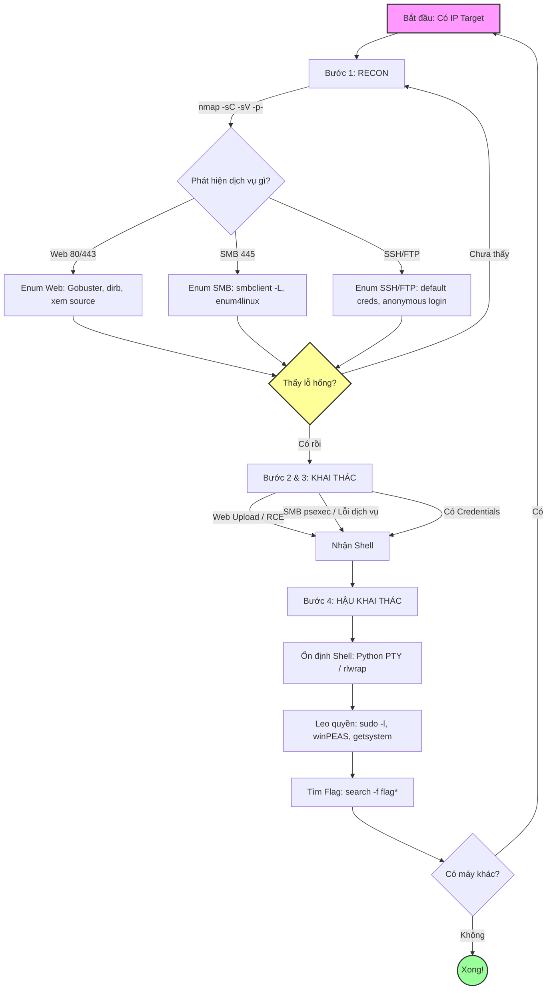

Đây, tao vẽ cho mày sơ đồ quy trình chuẩn để không bị ngợp. Cứ nhìn cái này mà đi từng bước một:

1- Cách nhìn sơ đồ: Mày cứ đi từ trên xuống. Gặp nút hình thoi (dấu hỏi) thì dừng lại tự hỏi "Có hay không?". Nếu "Chưa thấy" thì quay lại bước 1 (RECON) làm lại.

2- Ví dụ thực tế: 
- nmap thấy port 80 -> vào Web dò.
- Gobuster ra file `upload.php` -> thử upload shell.
- Nhận shell -> ổn định -> leo root -> lấy cờ -> quét tiếp máy khác.

3- Mẹo để không ngợp: Đừng bao giờ chuyển bước khi chưa ghi chép lại. Đang ở bước nào, làm xong chưa, nghi ngờ gì. Cứ giấy bút mà táng. Làm 5-10 box là tự khắc thành phản xạ.

