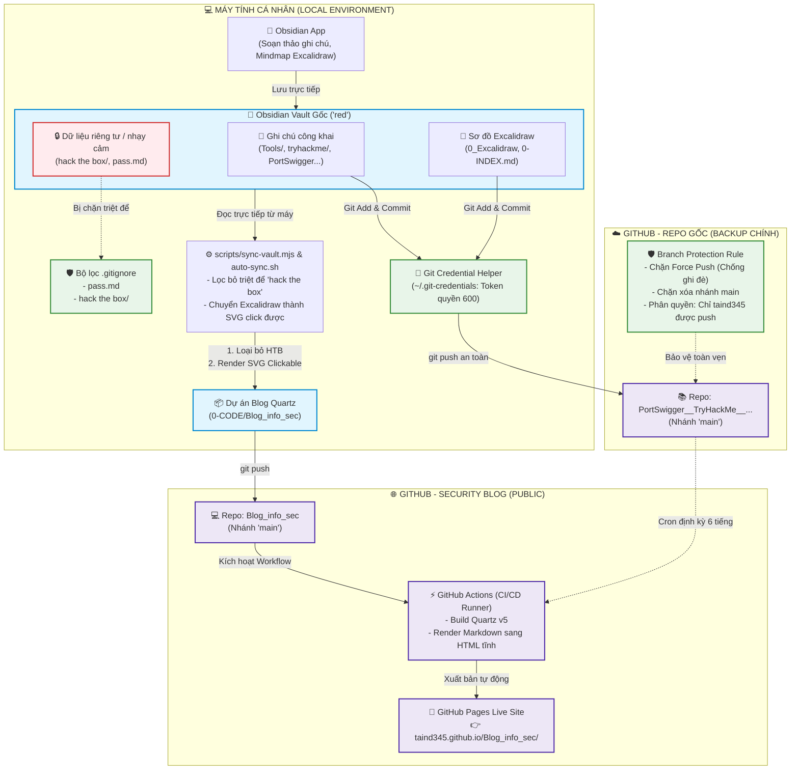

# 📘 SỔ TAY VẬN HÀNH & KIẾN TRÚC HỆ THỐNG (NỘI BỘ)

Tài liệu này ghi lại toàn bộ cấu trúc, cơ chế bảo mật và luồng dữ liệu tự động giữa **Kho ghi chú Obsidian cá nhân**, **Kho lưu trữ GitHub gốc** và **Website Security Blog (GitHub Pages)**.

---

## 🗺️ 1. Sơ đồ Kiến trúc & Luồng Dữ liệu Tổng thể



---

## 🛡️ 2. Hệ thống Bảo mật 3 Lớp (3-Tier Protection)

Hệ thống được thiết kế với 3 vòng phòng thủ nghiêm ngặt:

| Lớp bảo vệ | Thành phần | Cơ chế hoạt động |
| :--- | :--- | :--- |
| **Lớp 1: Lọc tại Local** | `.gitignore` & `sync-vault.mjs` | Chặn thư mục `hack the box/` và `pass.md` ngay từ máy tính. Thư mục này **không bao giờ** được Git theo dõi hay đẩy lên bất kỳ repo nào. Script Blog cũng chủ động quét và xóa sạch nếu phát hiện. |
| **Lớp 2: Bảo vệ Token** | `Git Credential Helper` | GitHub Personal Access Token (PAT) không bị gán lộ trong `.git/config` mà được lưu tại `~/.git-credentials` với quyền `chmod 600`. Chỉ riêng user `ti` trên máy mới có quyền đọc. |
| **Lớp 3: Khóa nhánh GitHub** | `Branch Protection Rules` | Kích hoạt trên nhánh `main` của repo gốc. Chặn hoàn toàn lệnh `git push --force` và chặn xóa nhánh. Không ai có thể ghi đè lịch sử commit. Quyền push bị giới hạn độc quyền cho tài khoản `taind345`. |

---

## 🔄 3. Hướng dẫn Vận hành Hàng ngày (Daily Cheatsheet)

### Bước 1: Viết ghi chú trong Obsidian
- Bạn mở Obsidian và soạn thảo tài liệu bình thường tại Vault:
  `"/home/ti/Desktop/DATA_DESKTOP/0_Obsidian notebook/red"`
- Các ghi chú trong `hack the box/` bạn cứ viết tự do, hệ thống đã cấu hình để **chỉ lưu ở máy bạn, không bị đẩy lên mạng**.

### Bước 2: Lưu và Backup lên Repo GitHub gốc
Khi muốn backup ghi chú lên GitHub:
```bash
cd "/home/ti/Desktop/DATA_DESKTOP/0_Obsidian notebook/red"
git add .
git commit -m "docs: cập nhật ghi chú mới"
git push origin main
```
> *(Lệnh push sẽ tự động dùng token trong Credential Helper, không cần gõ mật khẩu)*.

### Bước 3: Đẩy nội dung mới lên trang Blog (GitHub Pages)
Khi muốn xuất bản các bài viết mới lên website [taind345.github.io/Blog_info_sec/](https://taind345.github.io/Blog_info_sec/):
```bash
cd "/mnt/DATA_D/DESKTOP/DATA_DESKTOP/0-CODE/Blog_info_sec"
npm run auto-sync
```
Lệnh này sẽ tự động:
1. Đọc ghi chú từ Vault `red` trên máy của bạn.
2. Tự động loại bỏ thư mục `hack the box/` khỏi blog.
3. Chuyển đổi các sơ đồ tư duy Excalidraw thành file SVG tương tác (hỗ trợ zoom, click link).
4. Tự động commit và đẩy lên repo `Blog_info_sec`.
5. GitHub Actions sẽ tự build và trang web sẽ cập nhật sau khoảng 1-2 phút.

---

## 🛠️ 4. Xử lý Sự cố Nhanh (Troubleshooting)

1. **Website Blog chưa thấy bài mới**:
   - Nhấn **`Ctrl + F5`** (hoặc `Shift + F5`) trên trình duyệt để xóa cache trang web.
   - Chạy lệnh `npm run auto-sync` ở thư mục blog để ép đồng bộ ngay lập tức.
2. **Khi Token GitHub hết hạn (HTTP 401)**:
   - Tạo token mới tại: `https://github.com/settings/tokens/new` (tích quyền `repo`).
   - Cập nhật lại vào credential helper bằng lệnh:
     ```bash
     echo "https://taind345:<TOKEN_MỚI>@github.com" > ~/.git-credentials
     ```
